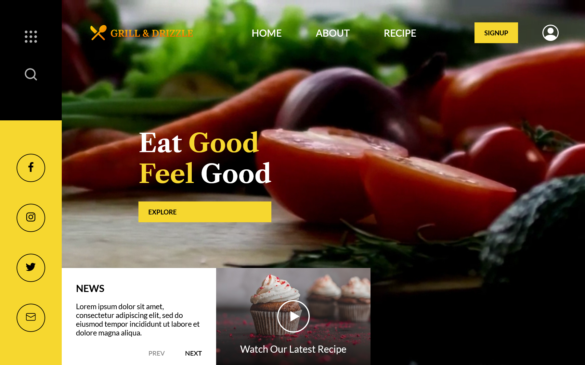

Not too complicated, not too simple website with a video clip on the background.

View Desktop version screenshot

  

View Mobile version screenshot

  

 
 

You can see this [this on GitHub Pages]. 
[Layout on the Figma](https://www.figma.com/community/file/1069612088209562135)

[this on GitHub Pages]: https://ulyanov-programmer.github.io/FoodPage/FoodPage/
